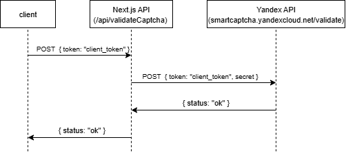

# Обеспечение безопасной обработки данных в формах при работе с персональными данными в России.

## Статус
Принято

## Контекст
Необходимо обеспечить безопасную обработку данных в формах при работе с персональными данными, в соответствии с требованиями законодательства и защитить систему от автоматизированных атак.

## Решение
### Обработка персональных данных
1. Необходимо явное соглашение на обработку персональных данных с проставлением галочки напротив текста
"Я даю согласие на обработку своих персональных данных ...".
2. Галочка на согласие не должна проставляться автоматически.
2. Форма не должна отправляться без проставленной галочки на согласие.
3. Присутствуем ссылка на документ с политикой конфиденциальности и обработкой персональных данных.

Плюсы:
- Прозрачность и соответствие юридическим требованиям

- Четкое доказательство получения согласия

### Защита от автоматизированных атак (Yandex SmartCaptcha)
Архитектурное решение:



1. После успешного заполнения капчи клиент вызывает `/api/validateCaptcha` с параметром `token` который генерируется автоматически после заполнения капчи.
2. Внутри `/api/validateCaptcha` вызывается эндпоинт на стороне Yandex `https://smartcaptcha.yandexcloud.net/validate` с параметрами `token` и `secret` (`secret` можно получить в личном кабинете, его обязательно добавляем в `.env` т.к это секрет) для валидации отправленного `token`.
3. После валидации вернется ответ, если `token` валидный то вернется `{ status: 'ok' }`, иначе `{ "status": "failed" }`.

Особенности работы:
1. Токен одноразовый, поэтому, если попробовать отправить несколько форм с одним токеном, мы получим ошибку с сообщением о том, что такой токен уже был использован.

Yandex SmartCaptcha имеет полноценный гайд по созданию и добавлению капчи на сайта, прочитать можно [тут](https://yandex.cloud/ru/docs/smartcaptcha/quickstart#node_1)

>В гайде по ссылке есть пример только для ванильного JS, в личном кабинете в сервисе Yandex SmartCaptcha есть пример кода для React. Для этого необходимо нажать на кнопку "Подключить" в верхнем правом углу.


Плюсы:
- Снижение автоматизированных атак ботов

Минусы:
- Пользователю приходится проделывать больше действий для отправки формы

## Отправка писем на почту
Используем mail.ru SMTP, более подробно про настройку можно прочитать [тут](https://help.mail.ru/mail/login/mailer/#setup).

Архитектурное решение:


1. После заполнения формы и выполнения капчи клиент вызывает `/api/sendEmail` который принимает следующие параметры:

```js
 {
    to: 'targetEmail',
    subject: `yourSubject`,
    message: `yourMessage`,
    html: 'html',
 }
```

2. Внутри этого эндпоинта используется библиотека [Nodemailer](https://nodemailer.com/), которая имеет методы для создания `transporter` со следующими параметра:

```js
 {
    host: `smtp.mail.ru`,
    port: 465,
    secure: true,
    auth: {
       user: yourEmail,
       pass: yourServicePassword,
    },
 }
```

3. Вызывается метод `transporter.sendEmail()` который отправляет сообщение на указанную почту (параметр `to`).


Плюсы:
- Бесплатно
- Прост в настройке

## Отображение формы только для пользователей из России
Из-за того, что в форме используются только Российские сервисы для капчи и отправки сообщений, эту форму можно только показывать пользователям из России.

Для этого используем стандартный инструмент в JS [Geolocation API](https://developer.mozilla.org/ru/docs/Web/API/Geolocation_API/Using_the_Geolocation_API). С него можно получить координаты пользователя, для того чтобы получить страну пользователя эти координаты нужно геокодировать, для этого используем пакет [coordinate_to_country](https://www.npmjs.com/package/coordinate_to_country).